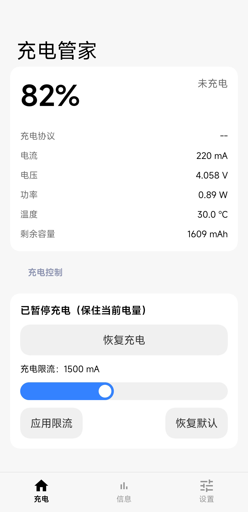
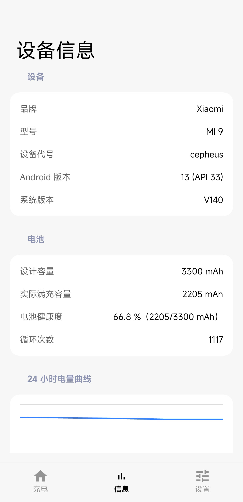
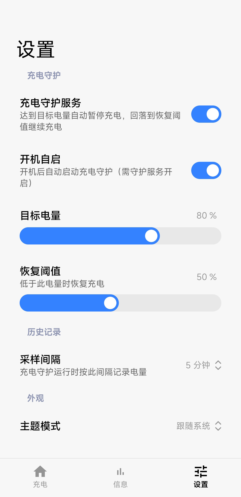
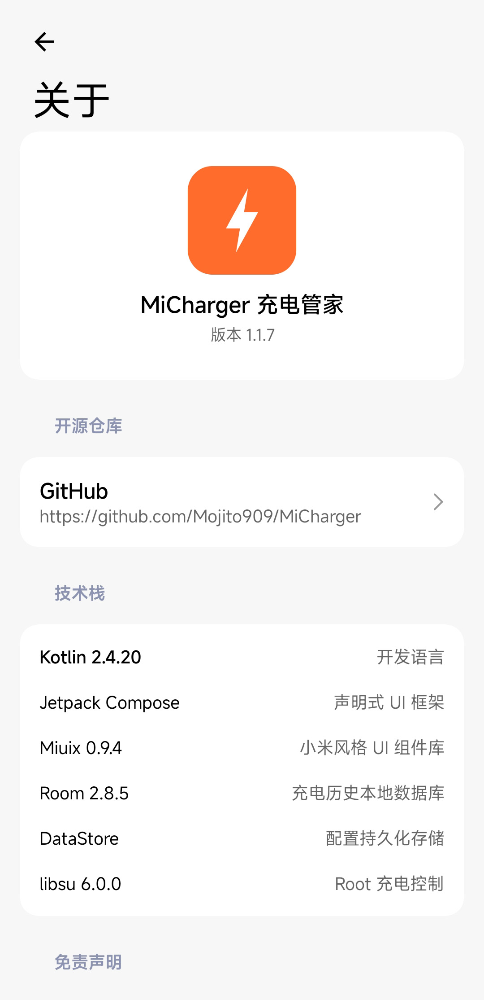

# MiCharger 充电管家

一款面向小米 9（`cepheus`）的 Android 充电控制工具。通过 Root / Magisk 读写电池电源节点，实现充电暂停、恢复、限流和充电守护，并提供电池状态、健康度与历史数据查看。

> 当前项目主要针对小米 9、Android 13 和 MIUI / HyperOS 相关环境开发。其他机型可能使用不同的电源节点，无法保证兼容性。

## 软件截图

| 充电 | 信息 |
|---|---|
|  |  |

| 设置 | 关于 |
|---|---|
|  |  |

## 软件功能

- **实时电池状态**：电量、电流、电压、功率、温度、剩余容量
- **充电控制**：暂停充电、恢复充电、设置充电限流
- **充电守护**：达到目标电量自动暂停，低于恢复阈值自动恢复
- **开机自启**：支持随系统启动充电守护服务
- **充电历史**：查看最近 24 小时电量曲线和今日充电次数
- **耗电排行**：Root 下读取 batterystats；无 Root 时使用前台时长估算
- **设备信息**：系统版本、电池设计容量、实际满充容量、健康度和循环次数

## 兼容性说明

| 项目 | 当前支持情况 |
|---|---|
| 推荐设备 | 小米 9（`cepheus`） |
| Android | 主要验证 Android 13 |
| 系统 | MIUI / HyperOS，具体能力取决于内核和电源节点 |
| Root | 充电控制、电池健康度和部分耗电统计需要 Root / Magisk |
| 无 Root | 可查看基础电池信息；耗电排行使用前台时长估算 |

## Root 与权限说明

| 权限 / 能力 | 用途 | 是否必须 |
|---|---|---|
| Root（Magisk） | 写入 `/sys/class/power_supply/battery/` 下的充电控制节点 | 充电控制必须 |
| Root（Magisk） | 读取部分电池健康度、循环次数和 batterystats 数据 | 部分信息需要 |
| 使用情况访问 | 无 Root 时估算应用前台耗电时长 | 可选 |
| 通知权限 | 显示充电守护前台服务通知 | 建议授予 |

充电控制涉及的节点可能包括：

- `input_suspend`
- `battery_charging_enabled`
- `constant_charge_current_max`

不同设备、内核和系统版本的节点名称及权限可能不同。应用不会保证在未验证设备上正常工作。

## 充电守护说明

开启充电守护后，应用会定期采样电池状态，并根据设置执行以下策略：

- 电量达到目标值：暂停充电
- 电量低于恢复阈值：恢复充电
- 记录电量历史和充电状态

充电历史和今日充电次数依赖守护服务运行期间产生的采样数据。首次开启服务后，历史数据不会立即完整显示。

## 免责声明

本项目会修改设备充电策略。错误的电源节点、内核行为或系统兼容性问题可能造成充电异常、电池损耗，甚至设备损坏。

请在理解风险并做好数据备份后使用。作者和贡献者不对因使用本项目造成的任何直接或间接损失负责。

## License

本项目基于 [MIT License](LICENSE) 开源。
